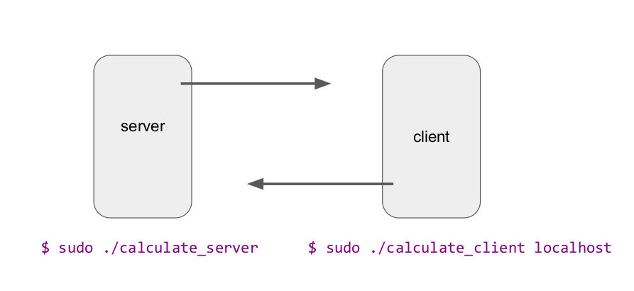
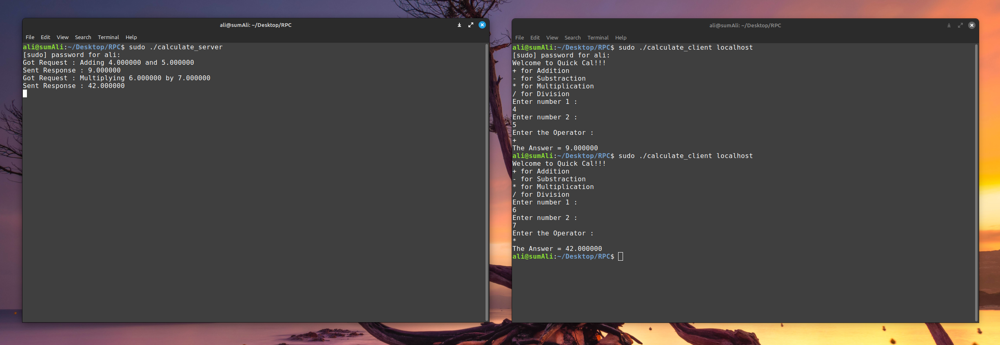

# RPC Application Development: Basic Arithmetic Operations

This repository contains a simple RPC (Remote Procedure Call) application that demonstrates the fundamental steps involved in developing an RPC-based system. The application performs basic arithmetic operations (addition, subtraction, multiplication, division) on two numbers provided by the client.

## Overview

The RPC framework allows a program to request a service to be executed on a remote server without having to worry about the underlying network technologies. This project illustrates how to set up client-server communication, develop the client and server programs, and utilize RPC for performing arithmetic operations.

## Getting Started

### Prerequisites

Ensure you have `rpcbind`, `libc-dev-bin`, and `gcc` installed on your system to compile and run the application. If not, you can install them using the following commands:

```bash
sudo apt-get update
sudo apt-get install rpcbind libc-dev-bin gcc
```

Verify `rpcbind` is running:

```bash
rpcinfo
```

### Steps involved in Developing an RPC Application

#### Step 1: Specify the Protocol for Client-Server Communication

1. Define your RPC protocol in a `.x` file. In this project, we use `calculate.x`.
2. Use `rpcgen` to generate the necessary files:

```bash
rpcgen -a -C calculate.x
```

This command generates the following files:
- `calculate_client.c` — Client program (editable file)
- `calculate_server.c` — Server program (editable file)
- `calculate_clnt.c` — Client stub
- `calculate_svc.c` — Server stub
- `calculate_xdr.c` — XDR (External Data Representation) filters
- `calculate.h` — Header file for any XDR filters
- `Makefile.calculate` — To compile all source files

#### Step 2: Develop the Client Program

Edit `calculate_client.c` to accept the client’s inputs from the keyboard and output the results of invoking the remote procedures (add, sub, mul, div).

#### Step 3: Develop the Server Program

Similarly, edit `calculate_server.c` to include your code for the previously defined remote methods (add, sub, mul, div).

#### Step 4: Compile

Compile the application using the generated Makefile:

```bash
sudo apt install make
make -f Makefile.calculate
```

### Running the Application

First, start the server:

```bash
sudo ./calculate_server
```

Then, request the client to perform operations by specifying the server's hostname (use `localhost` for local testing):

```bash
sudo ./calculate_client localhost
```

## Conclusion

This project demonstrates the basic setup and development process for an RPC application, emphasizing the ease with which distributed applications can communicate and perform operations across different systems.


### Project Photos



